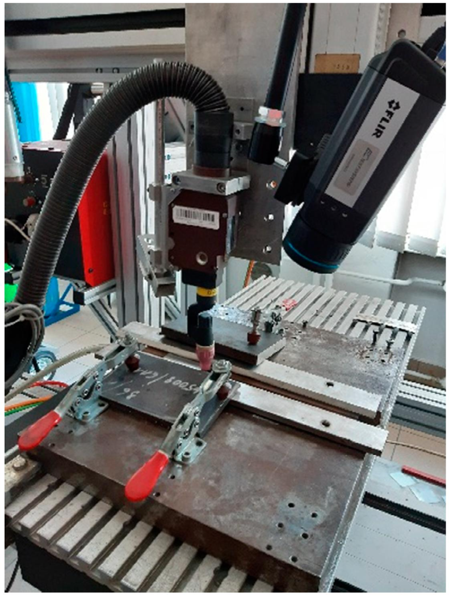
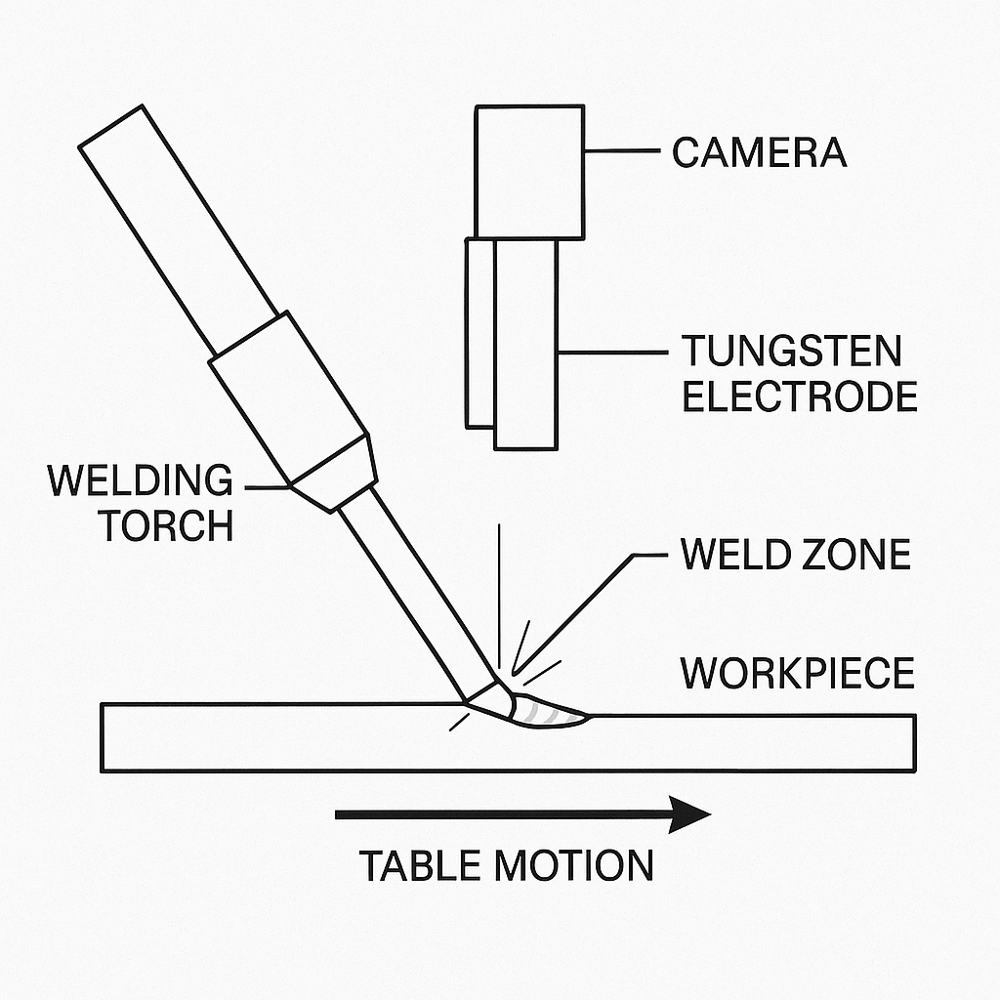
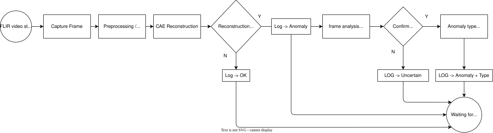
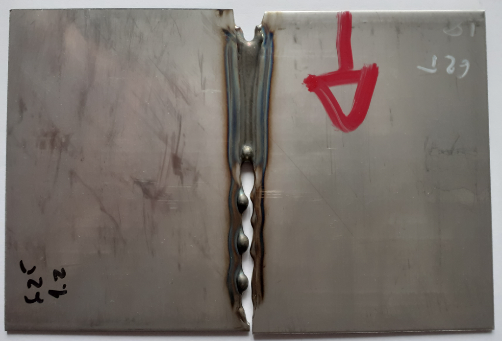
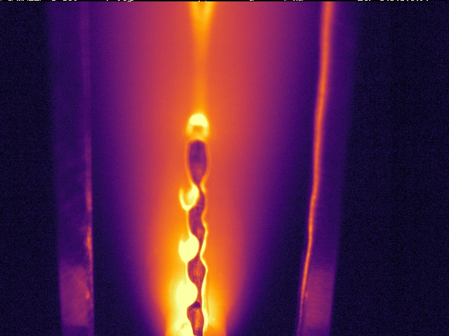
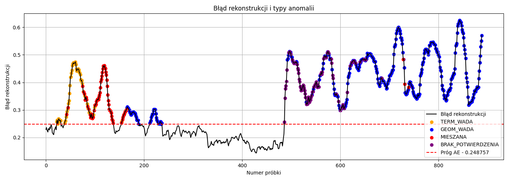
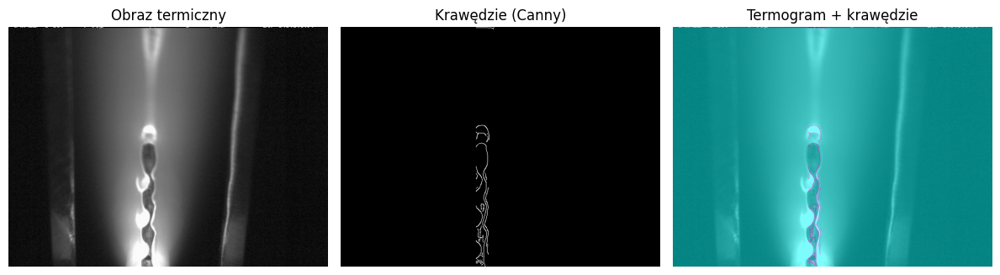
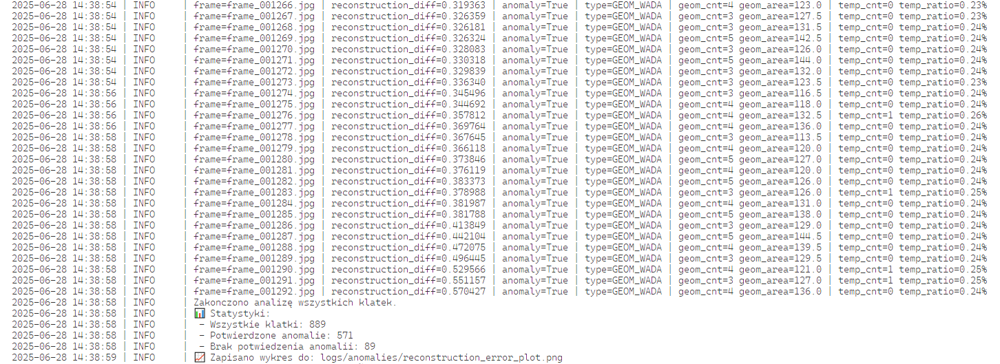

# Weld Thermal Anomaly Detection

> Automated detection of TIG weld defects from FLIR thermal camera recordings using an unsupervised Convolutional Autoencoder and supporting statistical methods.


---

## Overview


This project implements a two-stage anomaly detection pipeline for welding quality inspection using radiometric thermal imagery. Raw `.seq` recordings from a FLIR thermal camera are processed frame-by-frame to identify thermal and geometric irregularities in the TIG weld pool.

<p>
  
  
  
</p>

**Detection approaches:**

| Method | Description |
|--------|-------------|
| **Statistical (CV)** | Pixel-level mean ± 2σ thresholding inside a weld mask + Canny edge detection |
| **Autoencoder (DL)** | Convolutional Autoencoder trained on normal weld ROIs; high reconstruction error signals an anomaly |

**Quality classes assigned per frame:**

| Class | Meaning |
|-------|---------|
| `OK` | No anomaly detected |
| `TERM_WADA` | Thermal defect (hot/cold spot) |
| `GEOM_WADA` | Geometric irregularity (edge artefact) |
| `MIESZANA` | Both thermal and geometric anomaly |

---

## Project Structure

```
weld-thermal-anomaly-detection/
├── main_anomaly_detection.py       # Main OOP inference script
│
├── notebooks/                      # Numbered pipeline notebooks
│   ├── 01_extract_frames.ipynb     # .seq → radiometric TIFF + preview JPEG via flirpy Splitter method
│   ├── 02_temperature_analysis.ipynb
│   ├── 03_train_autoencoder.ipynb
│   ├── 04_detect_anomalies.ipynb
│   └── experiments/                # Research & scratch notebooks
│
├── src/                            # Reusable modules
│   ├── model.py                    # ConvAutoencoder definition
│   ├── dataset.py                  # PyTorch Dataset (segmentation)
│   ├── temp_analyzer.py
│   └── termo_autoencoder.py
│
├── scripts/                        # Standalone utility scripts
│   ├── read_seq.py                 # Split .seq files via flirpy
│   ├── process_tiff.py             # TIFF → preview JPEG + temperature CSV
│   ├── extract_all_rois.py         # Batch ROI extraction for training
│   ├── simulate_live_inspection.py # Real-time video simulation
│   ├── make_video.py               # Assemble frames into MP4
│   └── reader.py                   # CLI wrapper around flirpy
│
├── models/                         # Saved model weights (git-ignored)
├── data/                           # See data/README.md
└── assets/                         # Architecture diagrams (.drawio)
```

---

## Installation

```bash
git clone https://github.com/<your-username>/weld-thermal-anomaly-detection.git
cd weld-thermal-anomaly-detection

uv sync

# PyTorch with CUDA 12.4 is resolved automatically from the PyTorch index.
```

with pip (alternative)

```bash
python -m venv .venv
source .venv/bin/activate          # Windows: .venv\Scripts\activate

pip install -r requirements.txt
```

> **Note:** [`exiftool`](https://exiftool.org/) must be installed system-wide for FLIR `.seq` splitting.
> ```bash
> sudo apt install libimage-exiftool-perl   # Debian/Ubuntu
> ```

---

## Usage

### 1. Extract frames from a `.seq` recording

Place your `.seq` file in `seq_spoiny/`, then open `notebooks/01_extract_frames.ipynb`.

Output structure under `frames_output/<recording_name>/`:
```
radiometric/   ← raw 16-bit TIFF (temperature data)
preview/       ← 8-bit JPEG (FLIR default colourmap)
preview_fixed/ ← 8-bit JPEG (INFERNO colourmap, normalised per-frame)
```

Or via script (run from project root):
```bash
python scripts/read_seq.py
```

### 2. Analyse temperature statistics

```bash
python scripts/process_tiff.py
# → writes frames_output/<name>/temperature_stats.csv
```

Use `notebooks/02_temperature_analysis.ipynb` for interactive plots and anomaly scoring.

### 3. Prepare training data (ROI extraction)

```bash
python scripts/extract_all_rois.py
# → output_rois/train_roi_weld/  and  output_rois/train_roi_arc/
```

### 4. Train the Convolutional Autoencoder

Open `notebooks/03_train_autoencoder.ipynb`.
Weights are saved to `models/weld_autoencoder.pth` and `models/arc_autoencoder.pth`.

### 5. Run anomaly detection

**Notebook (interactive):**
Open `notebooks/04_detect_anomalies.ipynb`.

**Script (batch inference):**
```bash
# Edit the config dict at the bottom of main_anomaly_detection.py, then:
python main_anomaly_detection.py
# → logs/anomalies/system.log
# → logs/anomalies/reconstruction_error_plot.png
```

**Live simulation (from video file):**
```bash
python scripts/simulate_live_inspection.py
```

---

## Model — ConvAutoencoder

The CAE is trained in an unsupervised manner — only reference (non-anomalous) frames are used during training. Anomalies manifest as elevated reconstruction error at inference time.

```
Input (1×64×64)
  → Conv2d(1→8,  3×3, stride=2) + ReLU
  → Conv2d(8→16, 3×3, stride=2) + ReLU
  → Conv2d(16→32,3×3, stride=2) + ReLU   ← bottleneck (32×8×8)
  → ConvTranspose2d(32→16) + ReLU
  → ConvTranspose2d(16→8)  + ReLU
  → ConvTranspose2d(8→1)   + Sigmoid
Output (1×64×64)
```

Trained with MSE loss on *normal* weld frames. Frames whose reconstruction error exceeds a calibrated threshold are flagged, then further classified using CV heuristics (temperature statistics + edge density).

---

## Results

> *Examples from different sequences.*

Evaluated on **15 TIG welding sequences** with the following parameter ranges:

| Parameter | Range |
|-----------|-------|
| Current | 50–80 A |
| Travel speed | 3–7 mm/s |
| Material | Inconel 600, Inconel 625 |

The system correctly identified weld discontinuities and thermal irregularities across all test sequences.

Material and flir output (after splitting from .seq by flirpy)
<p>
  
  
</p>

Autoencoder reconstruction error with statistical methods fusion diagram


Statistical algorythms fusion


Logs from final anomaly detection run



---

## TODO / Future Work

- [ ] CLI interface for `main_anomaly_detection.py` (argparse)
- [ ] Replace hardcoded ROI coordinates with a config file (YAML/JSON)
- [ ] Evaluate SSIM loss vs MSE for autoencoder training
- [ ] Add labelled dataset and supervised classifier benchmark
- [ ] Export model to ONNX for deployment on edge hardware
- [ ] Docker container for reproducible environment

---

## Data

Raw `.seq` recordings are not included in this repository due to file size.
See [`data/README.md`](data/README.md) for details.

---

## License

MIT
